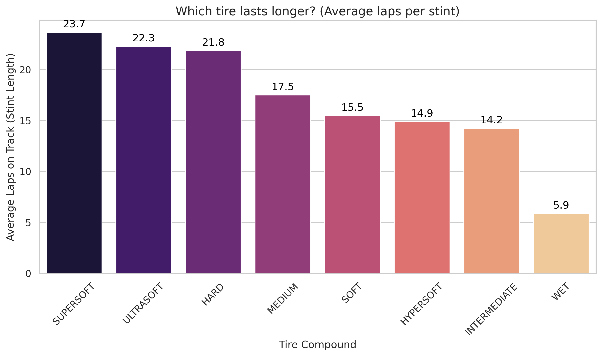
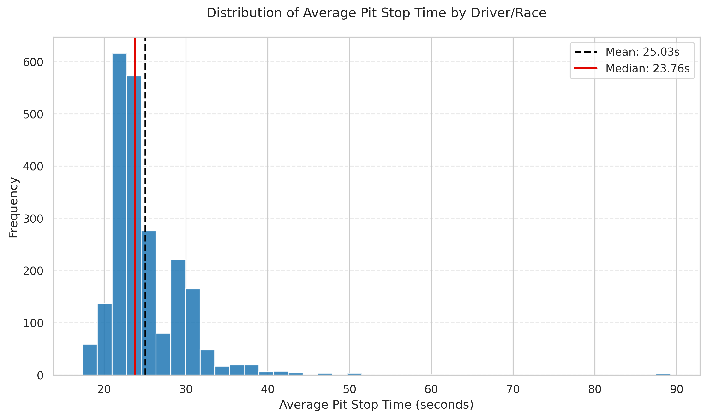
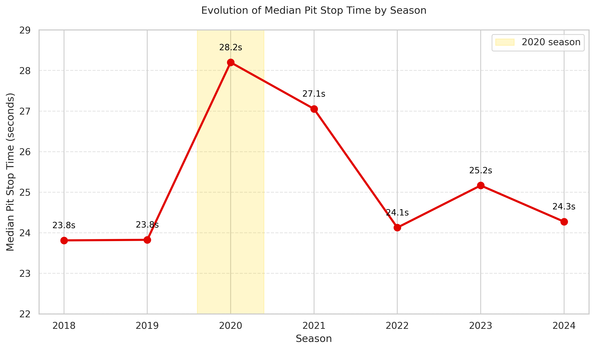
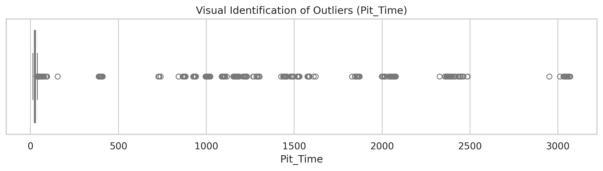
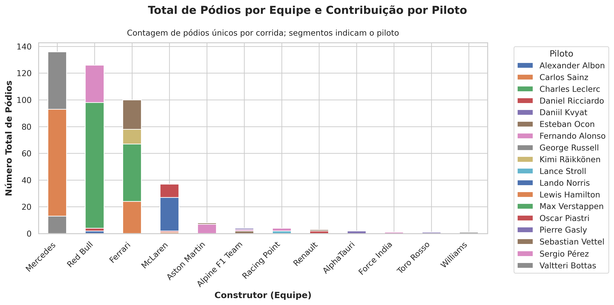

# Formula 1 Data Analysis - Exploratory Data Analysis

[Português](README_PTBR.md)

Exploratory data analysis project using Formula 1 stint, tire, pit stop, weather and performance data from 2018 to 2024.

## Goal

The goal of this project is to explore race patterns in Formula 1 data, focusing on:

- average stint length by tire compound;
- pit stop time distribution;
- pit stop outlier detection;
- possible associations between track conditions and operational performance;
- driver aggression and tire usage metrics.

## Dataset

Source referenced in the original notebook:

Kaggle - F1 Stint Data with Aggression Scores  
https://www.kaggle.com/datasets/akashrane2609/f1-stint-data-with-aggression-scores

The inspected notebook works with 2018-2024 data, containing 7,374 rows and 30 columns.

## Tools

- Python
- Pandas
- NumPy
- Matplotlib
- Seaborn
- Jupyter Notebook / Google Colab


## Skills Demonstrated

- Exploratory Data Analysis
- Data Cleaning
- Data Visualization
- Outlier Detection
- Descriptive Statistics
- Data Quality

## Analysis Workflow

1. Data loading and initial inspection.
2. Driver name correction for encoding inconsistencies.
3. Data structure, data types and descriptive statistics.
4. Duplicate, missing value and logical inconsistency checks.
5. Removal of records without real pit stop information.
6. Weather value imputation using race-level medians.
7. Pit stop outlier detection using the interquartile range method.
8. Correlation analysis between numerical variables.
9. Visual analysis of tires, pit stops, track temperature and aggression metrics.

## Main Findings

- The original dataset had no duplicated rows.
- After removing records without real pit stop data, the analysis dataset contained 4,564 rows.
- The IQR method flagged pit stops above 39.24s as outliers.
- The largest `Pit_Time` outliers appeared in the 2022 British Grand Prix, an event affected by a red flag.
- For `AvgPitStopTime` filtered up to 120s, using one observation per driver-race, the mean was 25.03s and the median was 23.76s.
- SUPERSOFT, ULTRASOFT and HARD had the highest average stint length in the analyzed dataset.

## Visualizations

### Average stint length by tire compound



This chart compares the average number of laps per stint across the tire compounds available in the dataset.

### Average pit stop time distribution by driver-race



Using one observation per driver-race and filtering average pit stop times up to 120 seconds, the mean was **25.03s** and the median was **23.76s**.

### Median pit stop time by season



The chart shows how the median average pit stop time changed across the 2018–2024 seasons.

### Pit stop outliers



The IQR method was used to identify unusually high `Pit_Time` values and separate exceptional race events from typical pit stop observations.

### Podiums by constructor and driver



Podiums are counted once per driver-race to avoid duplicate counts caused by the stint-level structure of the dataset.

## Methodological Notes

This is an exploratory analysis. Correlations and visual trend lines should be interpreted as observed associations, not as evidence of causality.

Some charts require revision before being used for final conclusions. In particular, podium analysis should count unique season/race/driver/position combinations, because the dataset is stint-level and may contain multiple rows for the same driver in a race.

## Suggested Repository Structure

```text
f1-data-analysis/
├── README.md
├── requirements.txt
├── data/
│   └── README.md
├── notebooks/
│   └── f1_exploratory_data_analysis.ipynb
├── src/
│   ├── data_cleaning.py
│   └── visualization.py
├── images/
│   ├── stint_length_by_tire_compound.png
│   ├── avg_pit_stop_by_season.png
│   └── pit_stop_distribution.png
└── reports/
    └── technical_notes.md
```

## How to Run

1. Download the dataset from the Kaggle link above.
2. Place the file in `data/raw/`.
3. Install the dependencies:

```bash
pip install -r requirements.txt
```

4. Run the notebook in `notebooks/`.
